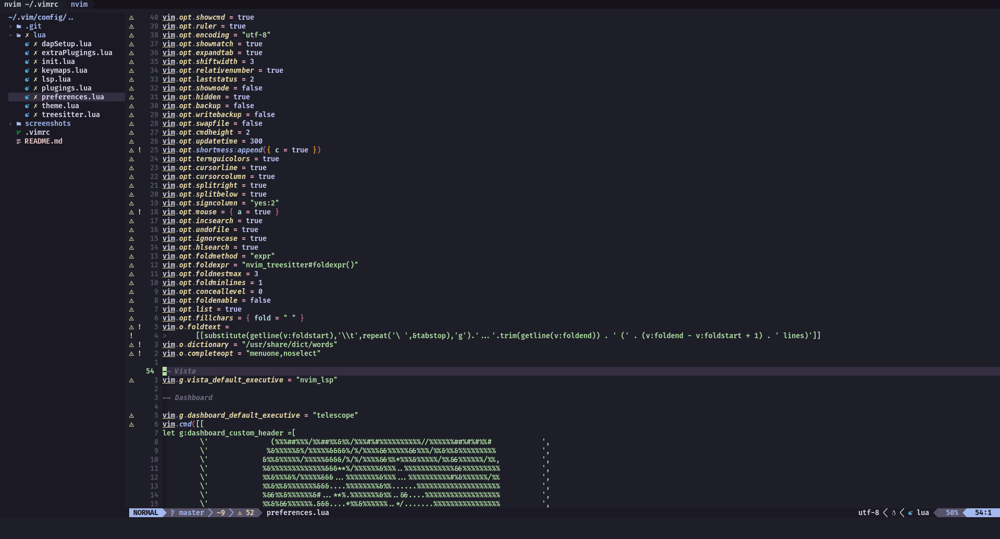

## Plugings used

[Gruvbox material](https://github.com/sainnhe/gruvbox-material)

[Nerdtree](https://github.com/preservim/nerdtree)

[Tmux navigator](https://github.com/christoomey/vim-tmux-navigator)

[Lsp config](https://github.com/neovim/nvim-lspconfig)

[Lsp install](https://github.com/kabouzeid/nvim-lspinstall)

[Nvim cmp](https://github.com/hrsh7th/nvim-cmp)

[Nvim cmp lsp](https://github.com/hrsh7th/cmp-nvim-lsp')

[Cmp luasnip](https://github.com/saadparwaiz1/cmp_luasnip)

[Luasnip](https://github.com/L3MON4D3/LuaSnip)

[Snippets](https://github.com/rafamadriz/friendly-snippets)

[Nvim-treesitter](https://github.com/nvim-treesitter/nvim-treesitter)

[Auto pairs](https://github.com/jiangmiao/auto-pairs)

[Plenary](https://github.com/nvim-lua/plenary.nvim)

[Telescope](https://github.com/nvim-telescope/telescope.nvim)

[Devicons](https://github.com/ryanoasis/vim-devicons)

[Vista lsp](https://github.com/liuchengxu/vista.vim)

[Multiple cursors](https://github.com/terryma/vim-multiple-cursors)

[JDTLS](https://github.com/mfussenegger/nvim-jdtls)

[Vimtex latex](https://github.com/lervag/vimtex)

[Lspsaga](https://github.com/glepnir/lspsaga.nvim)

[Lsp signature](https://github.com/ray-x/lsp_signature.nvim)

[TS utils](https://github.com/folke/nvim-lsp-ts-utils)

[Lsp colors](https://github.com/folke/lsp-colors.nvim)

[Twilight nvim](https://github.com/folke/twilight.nvim)

[Trouble nvim](https://github.com/folke/trouble.nvim)

[Devicons lua](https://github.com/kyazdani42/nvim-web-devicons)

[TodoComments](https://github.com/folke/todo-comments.nvim)

[Null ls](https://github.com/jose-elias-alvarez/null-ls.nvim)

[Vim commentary](https://github.com/tpope/vim-commentary/)

[Vim custom comment string](https://github.com/JoosepAlviste/nvim-ts-context-commentstring)

[Nvim autotag](https://github.com/windwp/nvim-ts-autotag)

[Vim autopep8](https://github.com/tell-k/vim-autopep8)

[Nvim colorizer](https://github.com/norcalli/nvim-colorizer.lua)

[Lualine](https://github.com/hoob3rt/lualine.nvim)

[Cmp emoji](https://github.com/hrsh7th/cmp-emoji)

[Cmp calc](https://github.com/hrsh7th/cmp-calc)

[Cmp path](https://github.com/hrsh7th/cmp-path)

[Lsp-kind](https://github.com/onsails/lspkind-nvim)

[Vim signify](https://github.com/mhinz/vim-signify)

[Dashboard](https://github.com/glepnir/dashboard-nvim)

[Kitty vim](https://github.com/fladson/vim-kitty)

[DAP](https://github.com/mfussenegger/nvim-dap)

[DAP UI](https://github.com/rcarriga/nvim-dap-ui)

[DAP virtual text](https://github.com/theHamsta/nvim-dap-virtual-text)

[Treesitter playground](https://github.com/nvim-treesitter/playground)

[Wakatime](https://github.com/wakatime/vim-wakatime)

[Nerdtree colors](https://github.com/tiagofumo/vim-nerdtree-syntax-highlight)

## Optimized languages

- Python
- C++
- C
- Latex
- Typescript/Javascript/React
- Java
- HTML/CSS

## Colorscheme

Gruvbox material

## Screenshots

